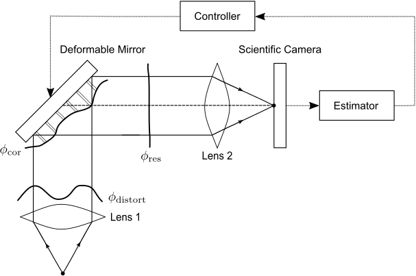

# MPC for Sensorless AO
[](https://hits.seeyoufarm.com)

This repository is a `Matlab` implementation of the model predictive control of time-varying aberrations for sensorless adaptive optics from Jinsung~Kim et al. [[1]].
A schematic diagram of the sensorless AO system is shown below.



Incoming light with time-varying phase aberration  caused by atmospheric turbulence is directed to the DM with a corrected wavefront .
The reflected beam with residual wavefront aberration  is entered onto a scientific camera, such as a CCD or CMOS, to measure the PSF.
The estimator determines the Zernike coefficient constituting  without using a wavefront sensor, based on the approximate model.
The controller computes the applied voltage to each actuator of the DM to correct the aberration of the newly incoming light.

The block diagram for `Matlab` simulation is represented as follow.


##  Generating Time-varying Phase aberration
The time-varying phase aberration caused by atmospheric turbulence is generated by **Object-Oriented MATLAB & Adaptive Optics (OOMAO) Toolbox** [[2]].
The OOMAO sources are hosted by GitHub (https://github.com/rconan/OOMAO).
To illustrate a complex environment such as the real-world atmosphere, we designed a *mainly frozen-flow model* with three layers at diferent heights, wind speeds, and directions [[3]].

```matlab
clear;clc;close all;
addpath(genpath('.\OOMAO-master'))

samplingFreq = 200; % turbulence sampling frequency
nSimSteps = 2000; % total number of phase screen
nPolynomials = 28; % number of zernike modes (radial number = 6)

D = 1; % telescope diameter [m]
r0 = 0.2; % Fried parameter [m] % The strength of atmospheric turbulence (D/r0) is set as 5.
L0 = 42; % outer scale [m]

% mainly frozen-flow model
h = [1000, 5000, 12000]; % height [m]
v0 = [5, 7.5, 10]; % wind speed [m/s]
vD = [0, pi/3, 5*pi/3];

f_r0 = [0.7, 0.1, 0.2]./25; % Fractional r0

atm = atmosphere(photometry.V,r0,L0,'fractionnalR0',f_r0,'altitude',h,'windSpeed',v0,'windDirection',vD); % atmosphere

% telescope setting
nL = 128; % number of lenslet
nPx = 1; % number or pixel per lenslet
nRes = nL*nPx; % resolution
xaxis = 1:nRes;
d = D/nL; % lenslet pitch

tel = telescope(D,'resolution',nRes,'fieldOfViewInArcsec',2.5,'samplingTime',1/samplingFreq); % telescope
tel = tel + atm;

% V ( 0.550e-6 , 0.090e-6 , 3.3e12 ) : Photometric system where Band ( wavelength , bandwidth , zero point )
ngs = source('wavelength',photometry.V); % natural guide star
ngs = ngs.*tel;

sprintf('Calculating wavefront for %d steps ...',nSimSteps);

phase = []; time_phase = [];
for iSimStep=1:nSimSteps
    +ngs;
    +tel;
    phase(:,:,iSimStep) = ngs.meanRmPhase; % time-varying phase aberrations for each sampling time
    time_phase(iSimStep) = ngs.timeStamp;
end

% Fitting the Zernike coefficients constituting the time-varying phase aberrations
x = (-(nL-1):2:(nL-1))/(nL-1);
[X,Y] = meshgrid(x);
[theta,r] = cart2pol(X,Y);    % convert to polar coordinate
is_in = r <= max(abs(x));

r = r(is_in);
theta = theta(is_in);

N = 6; % order of zernike mode

ad_acc = []; 
for j=1:size(phase,3)
    z = squeeze(phase(:,:,j)); % Unit : [rad]
    [ad_new,nm_new] = zernmodfit(r,theta,z(is_in),N); % Modified Zernike Decomposition
    ad_acc = [ad_acc; ad_new(:,1)']; % Zernike coefficients constituting the time-varying phase
end
```

##  Model Identification based on Time-series method
The temporal dynamics of the Zernike coefficient  constituting the time-varying phase aberration  can be represented by a vector-valued autoregressive (VAR) model of order N_v


where  represents the time index,  are coefficient matrices, and ) is the white Gaussian noise.

To determine the VAR model, any system identification method such as time-series, machine learning, and extrapolation can be used.
In this study, we designed an AR model based on a time-series method.
An open-loop wavefront dataset  was used to identify the model parameters 

```matlab
num_data = size(ad_acc,1);

ad_acc(:,1) = []; % piston element is removed

num_train = 1000; % number of training set
num_valid = 500; % number of validation set
num_test = 500; % number of test set

PN = 2; % order of VAR model
AA = []; % model of training set
BB = [];

for i=PN+1:num_train
    for j=1:PN
        AA(i-PN,size(ad_acc,2)*(j-1)+1:size(ad_acc,2)*j) = ad_acc(i-j,:);
    end
    BB(i-PN,:) = ad_acc(i,:);
end

PARA = (AA'*AA)\AA'*BB;

A1 = (PARA(1:size(ad_acc,2),:))';
A2 = (PARA(1+size(ad_acc,2):2*size(ad_acc,2),:))';

BB_ts_train = AA*PARA;

% validation set
AA_valid = []; % model of validation set
BB_valid = [];
for i=1:num_test
    for j=1:PN
        AA_valid(i,size(ad_acc,2)*(j-1)+1:size(ad_acc,2)*j) = ad_acc(i+num_train-j,:);
    end
    BB_valid(i,:) = ad_acc(i+num_train,:);
end

BB_ts_valid = AA_valid*PARA;


ad_diff_test = BB_ts_valid - BB_valid;

RMSE_valid = []; RRMSE_valid = [];
for j=1:size(ad_acc,2)
    RMSE_valid = [RMSE_valid; sqrt(mean((BB_ts_valid(:,j) - BB_valid(:,j)).^2))];
    RRMSE_valid = [RRMSE_valid; RMSE_valid(j,1)/(max(BB_valid(:,j)) - min(BB_valid(:,j)))];
end

RMSE_valid = [0; RMSE_valid]; RRMSE_valid = [0; RRMSE_valid];

% Compare the zernike coefficients of validation set between original and generation via PARA
BB_valid = [zeros(size(BB_valid,1),1) BB_valid];
BB_ts_valid = [zeros(size(BB_ts_valid,1),1) BB_ts_valid];

BB_valid = [zeros(num_train,size(BB_valid,2)); BB_valid];
BB_ts_valid = [zeros(num_train,size(BB_ts_valid,2)); BB_ts_valid];

for i=1:size(ad_acc,2)
    j = i;
    figure(15)
    subplot(4,7,i)
    hold on
    plot(BB_ts_valid(:,j),'b-','LineWidth',1.5)
    plot(BB_valid(:,j),'r--','LineWidth',1.5)
    hold off
    axis square
    title(['\alpha_{k}(' num2str(j) ')'])
    xlabel('Time index, k')
    xlim([(num_train + 1) (num_train + num_test)])
    ylim([-2 2])
    set(gca,'FontSize',15)
end
legend('Predicted','Actual')
```


## The influence matrix of Deformable Mirror (DM) generation
The influence matrix for each actuators was designed as a Gaussian influence function: 
%20=%20\textrm{exp}\left(\textrm{ln}(c)%20\displaystyle\frac{(\chi-\chi_{0,j})^2}{d^2}%20\right))

If the DM is operated as a modal method, the corrected wavefront and influence functions are decomposed into a set of Zernike polynomials:
%20=%20\sum_{r=1}^{n}%20b_{r,j}%20Z_r(\chi)%20%20\Leftrightarrow%20%20%20\mathcal{I}%20=%20\mathcal{Z}B)

Therefore, the influence matrix can be obtained by the least-squares method 

```matlab
dx = 6.5e-6; %0.1e-6;   % pixel spacing (m)

coupling = 0.1; % coupling parameter, defining the width of functions [0.05 ~ 0.15]
D = 4.4e-3; % telescope diameter, [m]
m1 = 12; % number of actuator array, m = (m1)^2
m = m1^2; % total number of actuators

n = 6; % order of zernike mode -> total 28 modes
nx = (n+1)*(n+2)/2;

d = D/(m1-1); % distance between actuators in pupil plane

len_dm = round((2.2e-3)*2/dx);
xaxis_dm = ((-len_dm/2):(len_dm/2-1))*dx;
yaxis_dm = -xaxis_dm;

[XX_dm,YY_dm] = meshgrid(xaxis_dm,yaxis_dm);  %2-D arrays hold x location and fy location of all points

diff_dm_idx = floor(len_dm/(m1-1));
x0_dm_idx = 1;
for i=1:(m1-1)
    x0_dm_idx = [x0_dm_idx; 1+i*diff_dm_idx];
end
x0_dm_idx(end) = len_dm;

x0_dm_axis = xaxis_dm(x0_dm_idx)';
y0_dm_axis = yaxis_dm(x0_dm_idx)';

act_idx = 0;
B_dm = zeros(len_dm,len_dm,m);
for i=1:m1
    for j=1:m1
        x_diff = XX_dm - x0_dm_axis(j);
        y_diff = YY_dm - y0_dm_axis(i);
        act_idx = act_idx + 1;
        
        B_g = 0 + 1*exp( log(coupling)*( ((x_diff).^2 + (y_diff).^2 )/(d^2) ) );
        
        B_dm(:,:,act_idx) = B_g;
    end
end

% pupil plane
len = 512; % number of pixels in the array
cen = len/2 + 1;
df = 1/(len*dx); % spacing in the spatial frequency domain (cycles/m)

xaxis = ((-len/2):(len/2-1))*dx;
yaxis = -xaxis;

[XX,YY] = meshgrid(xaxis,yaxis);  %2-D arrays hold x location and fy location of all points

N = len-1;
x = (-N:2:N)/N;
[X,Y] = meshgrid(x);
[theta,r] = cart2pol(X,Y);    % convert to polar coordinate
is_in = r <= max(abs(x));
% z(~is_in) = nan;
r = r(is_in);
theta = theta(is_in);

[t1,max_idx] = min(abs(xaxis_dm - xaxis(end)));
[t2,min_idx] = min(abs(xaxis_dm - xaxis(1)));

B_pupil = zeros(len,len,m); B_pupil_isin = zeros(size(r,1),m);
for t=1:size(B_dm,3)
    B_pupil(:,:,t) = B_dm(min_idx:max_idx,min_idx:max_idx,t);
    temp = B_pupil(:,:,t);
    B_pupil_isin(:,t) = temp(is_in);
end

% Fitted by Zernike polynomials
load("./Zs.mat") % load Zernike polynomials

Zs_new = reshape(Zs,size(Zs,1),len^2)'; 
B_pupil_new = reshape(B_pupil,len^2,size(B_pupil,3));

B = pinv(Zs_new'*Zs_new)*Zs_new'*B_pupil_new; % Influence matrix
```

##  Model Predictive Control Simulation

```matlab
% The strength of atmospheric turbulence (D/r0) is magnified by 10, 15, 20.
mag_conv_5 = 1;
mag_conv_10 = 1.781797436291855;
mag_conv_15 = 2.498049532979032;
mag_conv_20 = 3.174802103932926;

phase = phase .* mag_conv_10;
ad_acc = ad_acc .* mag_conv_10;

A1 = A1'; % input_data에 저장된 A가 x*A 형태로 쓰였기 때문에 변환 필요
A2 = A2';

% piston element is removed
B(1,:) = []; A_s(:,1) = []; A_s_est(:,1) = []; ad_acc(:,1) = []; 
```
### Setup the simulation parameters
``` matlab
load("./model_approx.mat") % load first-order approximation model
load("./SNR_10.mat") % load measurement noise (SNR = 10 [dB])
sample = 1;

mag_conv_5 = 1;
mag_conv_10 = 1.781797436291855;
mag_conv_15 = 2.498049532979032;
mag_conv_20 = 3.174802103932926;

phase = phase .* mag_conv_10;
ad_acc = ad_acc .* mag_conv_10;

% A = A'; % VAR(1) model
A1 = A1'; % input_data에 저장된 A가 x*A 형태로 쓰였기 때문에 변환 필요
A2 = A2';

% piston element is removed
B(1,:) = []; A_s(:,1) = [];

nx = size(A1,1); % number of state
nu = size(B,2); % number of input
p = size(A_s,1); % number of measurements   

n_mode = 6; % number of zernike modes
N = 2; % prediction horizon for MPC
T_final = 500; % size(phase,3) - num_train - num_test;
T_settle = 1.0e-3;
T_s = 0.1e-3; % sampling time of MPC Simulation
T_s_tur = 5e-3;

%% J = U'*H*U + r'*U + c
Q = (1.5e+4)*eye(nx,nx); % weighting matrix for error state
P = (1e+0)*Q; % weighting matrix for terminal error 
R = (1e+0)*eye(nu,nu);% weighting matrix for cost function

% SNR = 10; % the magnitude of desired SNR [db]

coeff_a = 0.047275; coeff_b = 2.709264; coeff_c = 0; % Unit change parameters (Voltage to Deflection)

u_min = -28*ones(nu,1); % input box constraint [rad]
u_max = 28*ones(nu,1);  % 28 [rad] -> 200 [V]

du_min = -0.2121*ones(nu,1); % ramp-rate constraint [rad]
du_max = 0.2121*ones(nu,1);

U_min = repmat(u_min,N,1);
U_max = repmat(u_max,N,1);

dU_min = repmat(du_min,N,1);
dU_max = repmat(du_max,N,1);

```


### Make pixel array for image plane and pupil plane
```matlab
% y_ref generation by FFT2
mag = 1; % FFT magnification
res = len*mag; % resolution of FFT 
dx = 6.5e-6; %0.1e-6;   % pixel spacing [m]
wavelength = 532.0e-9;   % [m]
unit_change = wavelength/(2*pi)*1e+9; % Unit conversion : [rad] to [nm]

xaxis_res = ((-res/2):(res/2-1))*dx/mag;
yaxis_res = -xaxis_res;

range_min = find(abs(xaxis_res-(-1.0e-4)) < 3e-6, 1, 'first');
range_max = find(abs(xaxis_res-(+1.0e-4)) < 3e-6, 1, 'last');
diff = (range_max - range_min + 1);
AU = 1e+12; % Arbitrary unit for point spread function

fxaxis = ((-len/2):(len/2-1))*df;
fyaxis = -fxaxis;
[FX,FY] = meshgrid(fxaxis,fyaxis);  % 2-D arrays hold fx location and fy location of all points
freq_rad = sqrt(FX.^2 + FY.^2);
maxfreq = (len/2-1)*df;

pupil_radius = 1.0*maxfreq; % NA / wavelength % radius of the pupil, inverse microns
pupil_area = pi*pupil_radius^2; % pupil area
pupil = double(freq_rad <= pupil_radius); % pin-hole

idx2 = 5; % Defocus (diversity function) index of Zernike polynomials

zd_dist = 3; % phase diversiy
zd_list = (-zd_dist:zd_dist:zd_dist); % [-3, 0, 3]
```

### MPC Simulation (Estimator + Controller)
First, we define one based on the Taylor series expansion around zero aberration:

%20+%20D_{1,j}(\beta_i)\alpha%20+%20\mathcal{O}(\|\alpha\|^2)).

A vector representation of each pixel j for all phase diversities  is given by

.


Then, the estimate of  is obtained by least squares:

)


```matlab
% Design matrix generation for Linear MPC
[H, M1, M2, Q_tilda, R_tilda, B_conv, B_conv_pre1, B_conv_pre2, E] = MPC_DesignMatrices(A1,A2,B,nx,nu,N,Q,P,R);
closed_form_matrix = -0.5*(pinv(H'*H))*(H');

% MPC Simulation for T_final step
U_acc = []; U_v_acc = []; dU_acc = []; X_acc = []; X_acc_err = [];
X_err = zeros(T_final,N); X_est_err = []; X_err_low = []; X_err_high = [];
ad_est_acc = []; ad_cor_acc = []; J = [];
T_mldivide = zeros(T_final,1); T_pinv = zeros(T_final,1); T_lsqmin = zeros(T_final,1); T_geninv = zeros(T_final,1); T_cvx = zeros(T_final,1); T_fmincon = zeros(T_final,1); T_sim = zeros(T_final,1); 

phase_cor = zeros(len,len,T_final); % corrected aberration by DM
phase_res = zeros(len,len,T_final); % residual aberration (phase_res = phase + phase_cor)
u_prev = zeros(nu,1); Y_M_acc = [];

ad_acc_valid = ad_acc(1+num_train+num_test:end,:);
phase_valid = phase(:,:,1+num_train+num_test:end);

for iSimStep = 1:T_final
    tic
    if iSimStep == 1
        phase_res(:,:,iSimStep) = phase_valid(:,:,iSimStep);
    else
        % ramp constraint for first control input, u[0|k]
        dU_min(1:nu,1) = du_min + u_prev;
        dU_max(1:nu,1) = du_max + u_prev;
        
        phase_res(:,:,iSimStep) = phase_valid(:,:,iSimStep) + phase_cor(:,:,iSimStep-1);
    end
    
    % Estimator
    Y_M = []; Y_M_noise = [];
    
    z = phase_res(:,:,iSimStep); % phase screen, unit : [m] (magnitude -1e-7 ~ -1e-7)
    scrn = z;

    for k=1:size(zd_list,2) %zd_list = -0.5:0.01:0.5 %-0.25:0.01:0.25 %-0.5:0.005:0.5 %-1:0.05:1
        zd_diversity = zd_list(k);
                        
        kW = zd_diversity.*squeeze(Zs(idx2,:,:)); % [rad] 비교를 동일하게 해주기 위해 phase diversity를 사용
        P_defocus = pupil.*exp(1i*(scrn+kW));

        % transfer function
        I_defocus = fftshift(fft2(fftshift(P_defocus),res,res))*dx^2;
        im = abs(I_defocus).^2;
        v_im(:,:,k) = im(range_min:range_max,range_min:range_max)*AU;
        Y_M = [Y_M; reshape(v_im(:,:,k),(range_max-range_min+1)^2,1)];
        
        % Y_M_noise = [Y_M_noise; rand(diff^2,1)*mean(Y_M((k-1)*diff^2+1:k*diff^2,1))/SNR];
    end
    Y_M_noise = squeeze(SNR_data(sample,iSimStep,:));
    
    Y_M = Y_M + Y_M_noise;
    Y_M_acc = [Y_M_acc; Y_M'];
    
    % ad_est = (A_s_est'*A_s_est)\(A_s_est)'*(Y_M-b_s_est); % ad_est = [0; (A_s'*A_s)\(A_s)'*(Y_M-b_s)];
    ad_est = lsqminnorm((A_s_est'*A_s_est),((A_s_est)'*(Y_M-b_s_est)));
    X_est_err = [X_est_err; norm(ad_est,2)];
    
    
    % residual aberration에 대한 zernike coefficient
    ad_est_acc = [ad_est_acc; ad_est'];
    
    % initial condition for MPC Controller
    x0 = ad_est;
    if iSimStep == 1
        x0_pre = zeros(nx,1);
    else
        x0_pre = ad_est_acc(iSimStep-1,:)';
    end
    
    %% b_ref generation
    if iSimStep == 1
        b_ref = zeros(N*nx,1);
    elseif iSimStep == 2
        b_ref = -M1*B*U_acc(iSimStep-1,:)';
    else
        b_ref = -M1*B*U_acc(iSimStep-1,:)' -M2*B*U_acc(iSimStep-2,:)';
    end
    
    
    %% r, c generation
    r = 2*(B_conv)'*Q_tilda*(M1*x0 + M2*x0_pre + b_ref);
    c = (M1*x0 + M2*x0_pre + b_ref)'*Q_tilda*(M1*x0 + M2*x0_pre + b_ref); % constant
    
    % Controller
```


## References
[[1]] Jinsung Kim, Kye-Sung Lee, Sang-Chul Lee, Ji Yong Bae, Dong Uk Kim, I Jong Kim, Ki Soo Chang and Hwan Hur. "Model Model Predictive Control of Time-varying Aberrations for Sensorless Adaptive Optics", arXiv preprint. [https://arxiv.org/abs/--](https://arxiv.org/abs/--)

[[2]] R. Conan and C. Correia, “Object-oriented Matlab adaptive optics toolbox,” in Adaptive Optics Systems IV (E. Marchetti, L. M. Close, and J.-P. Vran, eds.), vol. 9148 of Society of Photo-Optical Instrumentation Engineers (SPIE) Conference Series, p. 91486C, Aug. 2014.

[[3]] L. Prengere, C. Kulcs´ar, and H.-F. Raynaud, “Zonal-based highperformance control in adaptive optics systems with application to astronomy and satellite tracking,” J. Opt. Soc. Am. A, vol. 37, pp. 1083–1099, Jul 2020.

[1]: https://arxiv.org/abs/--
[2]: https://www.spiedigitallibrary.org/conference-proceedings-of-spie/9148/91486C/Object-oriented-Matlab-adaptive-optics-toolbox/10.1117/12.2054470.short
[3]: https://www.osapublishing.org/josaa/abstract.cfm?uri=josaa-37-7-1083
